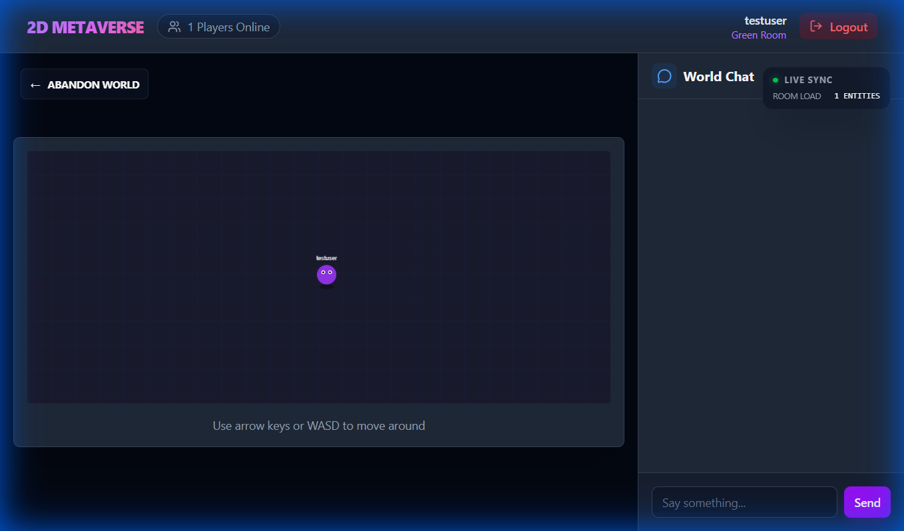

# 2D Metaverse 🚀

Welcome to the **2D Metaverse**, a high-performance, real-time multiplayer virtual world built with a focus on seamless interaction, modern aesthetics, and robust performance.



## ✨ Key Features

- **Real-time Multiplayer**: Powered by **Socket.io** for low-latency synchronization of player movement and actions across all clients.
- **Dynamic Room Management**: Create, join, and manage custom persistent rooms. Each room tracks its active players in real-time.
- **Session Persistence**: Never lose your place. Your position and session data are automatically persisted across page reloads.
- **Infinite Scaling (Lazy Loading)**: Utilizing **React Lazy & Suspense** for optimized initial page loads, splitting the application into logical feature modules.
- **Atomic Design System**: A future-proof codebase structured using **Atomic Design** principles (Atoms, Molecules, Organisms) for maximum reusability.
- **Premium Dark Aesthetics**: A stunning, modern UI featuring a **Glassmorphism-inspired** dark theme with vibrant purple accents.
- **Live Tech Chat**: Real-time communication within rooms, synced perfectly with player entities.

## 🛠️ Technology Stack

- **Frontend**: React, TypeScript, Vite, TailwindCSS (Vanilla CSS for custom components), Framer Motion.
- **Backend**: Node.js, Express, Socket.io, Mongoose (MongoDB).
- **Communication**: Real-time bidirectional events via WebSockets.
- **State Management**: React Context API (Auth, Game State).

## 🚀 Getting Started

### Prerequisites

- **Node.js** (v18.0.0 or higher)
- **MongoDB** (Local or Atlas)

### Installation

1.  **Clone the repository**:

    ```bash
    git clone https://github.com/00sukhjeet00/2d-metaverse.git
    cd 2d-metaverse
    ```

2.  **Server Setup**:

    ```bash
    npm install
    # Create a .env file with DATABASE_URL and JWT_SECRET
    npm start
    ```

3.  **Client Setup**:
    ```bash
    cd client
    npm install
    npm run dev
    ```

## 📜 Version History

- **v1.2.0**: Migrated to Atomic Design, added global purple theme, and implemented React Lazy loading.
- **v1.1.0**: Added persistence and session management.
- **v1.0.0**: Initial multiplayer release.

---

Built with ❤️ by the Metaverse Team.
